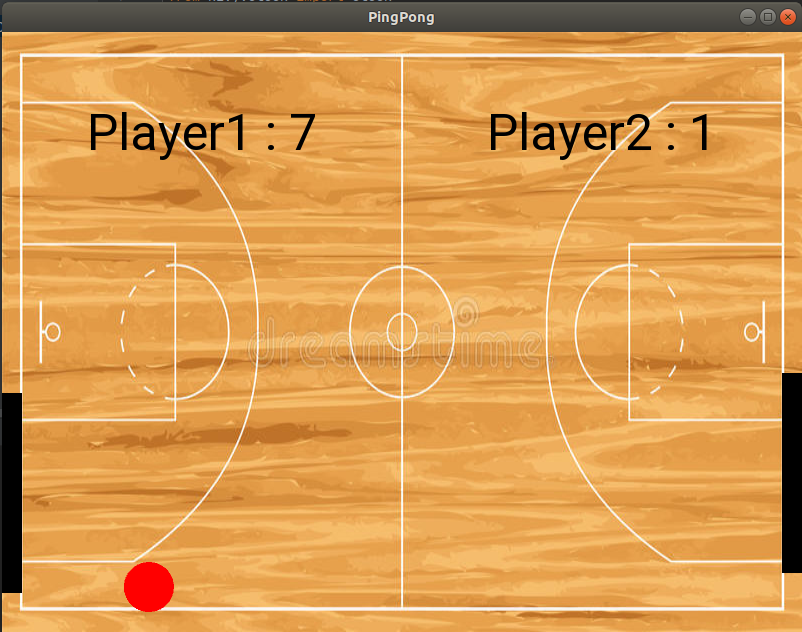
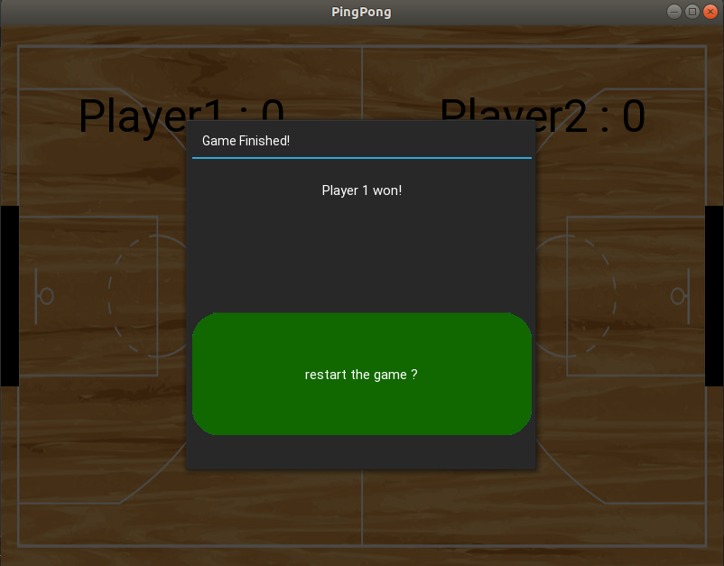

## **`Yet Another PinPong-Game Made With Kivy`**

### Android file with Buildozer
    * https://kivy.org/doc/stable/guide/packaging-android.html 
        

## :rocket:&nbsp;**`Run Project`**

    * python main.py

# GamePlay

# Restart Game

* :nerd_face: `work in progress` 